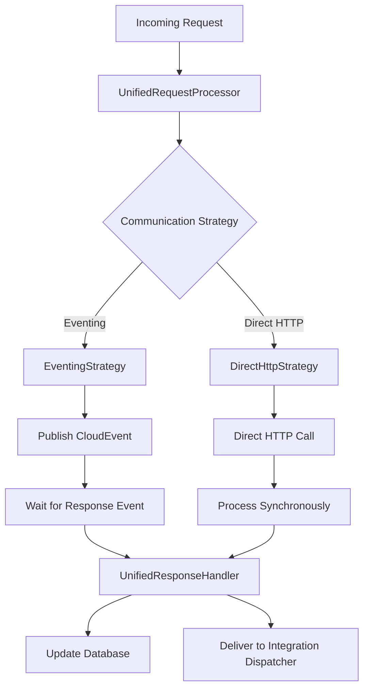
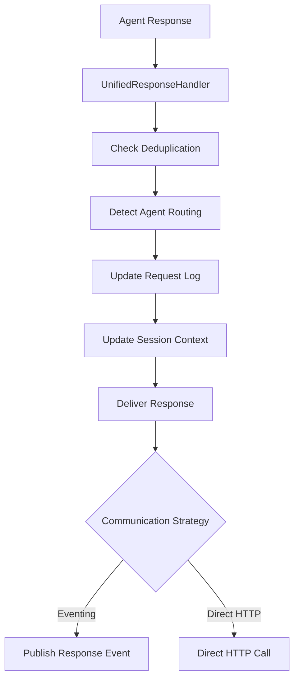

# Communication Mode Synchronization

## Problem Statement

The original implementation had **critical code duplication** between eventing and direct HTTP modes, leading to:

- **Code Drift**: Changes in one mode not reflected in the other
- **Inconsistent Behavior**: Different error handling, logging, and processing logic
- **Maintenance Nightmare**: Bug fixes needed in multiple places
- **Testing Complexity**: Separate test suites for each mode

## Solution: Unified Architecture

### 1. Communication Strategy Pattern

```python
# Abstract base class
class CommunicationStrategy(ABC):
    @abstractmethod
    async def send_request(self, normalized_request: NormalizedRequest) -> bool:
        pass
    
    @abstractmethod
    async def wait_for_response(self, request_id: str, timeout: int, db: AsyncSession) -> Optional[Dict[str, Any]]:
        pass
    
    @abstractmethod
    async def deliver_response(self, agent_response: AgentResponse) -> bool:
        pass

# Concrete implementations
class EventingStrategy(CommunicationStrategy):
    # Uses CloudEvents and Knative broker

class DirectHttpStrategy(CommunicationStrategy):
    # Uses direct HTTP calls
```

### 2. Unified Request Processor

```python
class UnifiedRequestProcessor:
    def __init__(self, strategy: CommunicationStrategy):
        self.strategy = strategy
    
    async def process_request_async(self, request, db: AsyncSession) -> Dict[str, Any]:
        # Shared logic for both modes
    
    async def process_request_sync(self, request, db: AsyncSession, timeout: int = 120) -> Dict[str, Any]:
        # Handles both eventing and direct HTTP synchronously
```

### 3. Shared Response Handler

```python
class UnifiedResponseHandler:
    async def process_agent_response(self, request_id: str, session_id: str, agent_id: str, content: str, ...) -> Dict[str, Any]:
        # Identical processing logic for both modes
        # - Deduplication checks
        # - Agent routing detection
        # - Database updates
        # - Session context updates
```

## Key Benefits

### ✅ **Single Source of Truth**
- All business logic in one place
- No duplication of request processing, response handling, or database updates
- Consistent error handling and logging

### ✅ **Automatic Synchronization**
- Changes automatically apply to both modes
- No risk of code drift
- Single test suite covers both modes

### ✅ **Easy Mode Switching**
```python
# Environment variable controls the strategy
eventing_enabled = os.getenv("EVENTING_ENABLED", "true").lower() == "true"
strategy = EventingStrategy() if eventing_enabled else DirectHttpStrategy()
```

### ✅ **Comprehensive Testing**
- Integration tests ensure both modes produce identical results
- Mode switching tests verify graceful transitions
- Response processing consistency tests

## Implementation Details

### Request Processing Flow



### Response Processing Flow



## Migration Strategy

### Phase 1: Implement Unified Architecture
1. ✅ Create `CommunicationStrategy` abstraction
2. ✅ Implement `UnifiedRequestProcessor`
3. ✅ Create `UnifiedResponseHandler`
4. ✅ Add comprehensive tests

### Phase 2: Refactor Existing Code
1. Replace `_process_request` and `_process_request_sync` with unified processor
2. Replace `_handle_agent_response_event` with unified response handler
3. Update all endpoints to use unified architecture

### Phase 3: Validation
1. Run integration tests for both modes
2. Verify identical behavior in production
3. Monitor for any regressions

## Testing Strategy

### Unit Tests
- Test each communication strategy independently
- Test unified processor with mocked strategies
- Test response handler with various scenarios

### Integration Tests
- Test complete request/response cycles in both modes
- Verify identical database state after processing
- Test mode switching without data loss

### End-to-End Tests
- Deploy both modes and compare results
- Test with real agent service and integration dispatcher
- Verify performance characteristics

## Configuration

### Environment Variables
```bash
# Control communication mode
EVENTING_ENABLED=true|false

# Service URLs for direct HTTP mode
AGENT_SERVICE_URL=http://agent-service:8080
INTEGRATION_DISPATCHER_URL=http://integration-dispatcher:8080

# Broker URL for eventing mode
BROKER_URL=http://knative-broker:8080
```

### Helm Values
```yaml
requestManagement:
  knative:
    eventing:
      enabled: true  # Set to false for direct HTTP mode
```

## Monitoring and Observability

### Logging
- Consistent log messages across both modes
- Mode identification in log entries
- Performance metrics for both strategies

### Metrics
- Request processing time by mode
- Success/failure rates by mode
- Response delivery success rates

### Alerts
- Mode switching events
- Performance degradation in either mode
- Communication failures

## Future Enhancements

### 1. Hybrid Mode
- Use eventing for high-volume requests
- Fall back to direct HTTP for critical requests
- Automatic failover between modes

### 2. Performance Optimization
- Connection pooling for direct HTTP
- Event batching for eventing mode
- Adaptive timeout strategies

### 3. Advanced Routing
- Load balancing between multiple agent services
- Geographic routing for distributed deployments
- Circuit breaker patterns

## Conclusion

The unified architecture eliminates code duplication, ensures consistency between communication modes, and provides a solid foundation for future enhancements. The strategy pattern allows for easy extension and testing, while the shared components guarantee identical behavior regardless of the underlying communication mechanism.

This approach transforms a maintenance nightmare into a clean, testable, and maintainable system that can evolve with changing requirements.
